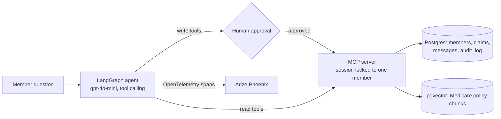
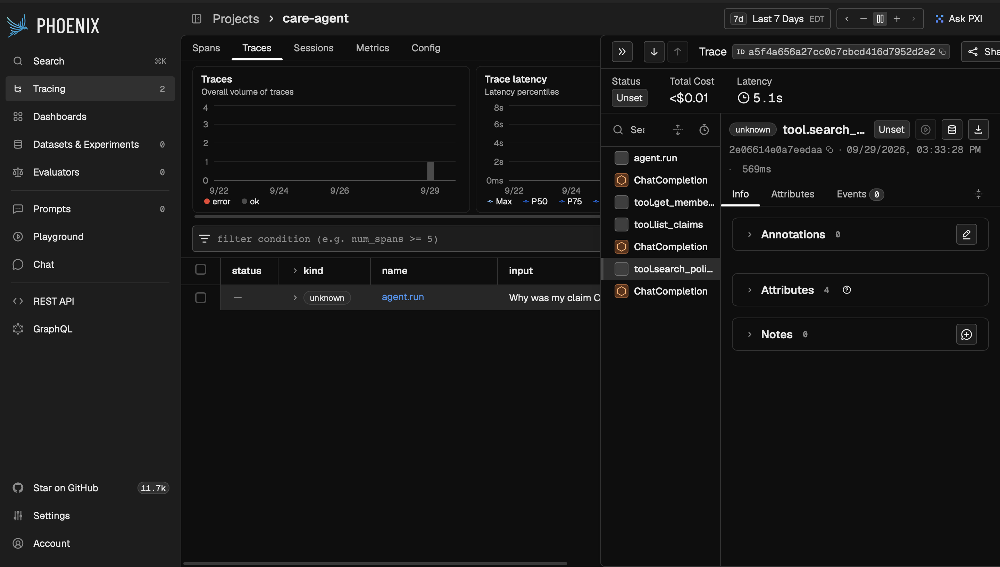

# Care Agent — a secure, tool-using Medicare member-services agent

An AI agent that **takes actions**, not just answers questions: it looks up a member's claims, explains denials using official Medicare policy, updates records and sends messages, with **human approval** for every write, **server-side access control**, an **audit log**, **tracing**, and a **measured evaluation**.

Tools are served over **MCP** (Model Context Protocol). Policy search reuses the pgvector knowledge base from [agentic-rag](https://github.com/nihitha-i/agentic-rag) (1,738 chunks of CMS Medicare documents). All member data is **synthetic** (20 fake members, 95 claims).

## Results

20 realistic member tasks x 3 runs, graded by GPT-4o plus rule-based checks. A task succeeds only if the agent used the right tools, requested approval exactly when needed, made the correct database change, stated the key facts, and gave a correct answer.

| Version | Task success | Tool selection | Approval correct | Unrequested writes | Latency |
| --- | --- | --- | --- | --- | --- |
| v1 baseline | 75% | 95% | 100% | 0 | 3.1s |
| v2 policy-grounding rules | 76.7% (70–80) | 95% | 100% | 0 | 3.4s |
| v3 fixed data-before-messaging and citation rules | **90%** (85–95) | **100%** | 100% | 0 | 3.7s |
| v3 + server-side access control | **95%** | **100%** | 100% | 0 | 4.0s |

- v3's worst run (85%) beat v1's best run (75%): the improvement is outside run-to-run noise.
- Adding access control caused **no loss** in task success.
- Cost per request is **under $0.01** (measured in Phoenix).

## Architecture



**MCP tools:** `search_policy`, `get_member_profile`, `list_claims`, `update_address` (write), `send_message` (write; demo, stores only).

## Safety design

1. **Human-in-the-loop:** `update_address` and `send_message` never run without explicit approval.
2. **Server-side access control:** each MCP server session is bound to one member (`CARE_MEMBER_ID`). Requests for any other member are refused in code, not by prompt instructions, so a confused or manipulated model cannot bypass it.
3. **Audit log:** every tool call, including every refusal, is recorded in `care.audit_log`.
4. **Grounded answers:** coverage claims must cite a policy document and page retrieved in the same conversation; no rules from memory.
5. **CI:** GitHub Actions runs the access-control tests against a fresh Postgres on every push.

## Observability

Every run is traced with OpenTelemetry and viewed in Arize Phoenix: each LLM call (prompt, response, tokens, cost) and each tool call (arguments, approval, duration).



The trace shows most latency comes from 3 sequential LLM calls rather than the tools (policy search: ~0.6s), so batching tool calls into fewer LLM turns is the next latency optimization.

## What I found and fixed along the way

**Evaluation bugs (fixed before trusting any number):**
- The judge saw only post-action data, so it marked successful address updates as "already up to date". Fixed by giving it data **before and after** the action.
- The synthetic-data seed was set once per process, so every reset generated **different data** mid-evaluation. Fixed by re-seeding inside each reset; results became reproducible.
- Added rule-based `must_mention` checks, after finding the LLM judge could accept a factually wrong answer.

**Agent bugs (found through error analysis):**
- It explained denied claims without searching policy.
- It sent a "summary of claims" **without looking the claims up**.
- It cited Medicare rules **from memory** without retrieving them.
- It ignored the member's Medicare Advantage plan when answering coverage questions.

v2's prompt changes fixed some tasks but broke others (overall 75% → 76.7%), which is why every change is measured against the full task set. v3 fixed all four bugs.

## Run it

Requires the database from [agentic-rag](https://github.com/nihitha-i/agentic-rag) (Postgres + pgvector with policy chunks loaded).

```bash
git clone https://github.com/nihitha-i/care-agent.git && cd care-agent
python3.11 -m venv .venv && source .venv/bin/activate
pip install -r requirements.txt
cp .env.example .env              # add your OpenAI key
python -m app.seed                # create synthetic members and claims
python -m app.agent "Why was my claim C1001-3 denied?"
python -m app.test_access         # access-control tests
python -m eval.run_tasks --runs 3 --label mytest
```

**Tracing:** run `docker run --rm -p 6006:6006 arizephoenix/phoenix:latest`, then add `PHOENIX_TRACING=1` before the agent command and open http://localhost:6006.

Note: uses the MCP Python SDK 1.x (`mcp<2`); 2.x renamed the server API.

## Limitations and next steps

- 20 tasks is a small evaluation; one task (`cardiac_rehab`) still fails.
- Test the defenses against a broader adversarial test suite.
- Parallelize tool calls to reduce latency.
- Migrate to MCP SDK 2.x; deploy a password-protected demo.

## Tech stack

Python · LangGraph · MCP (Model Context Protocol) · OpenAI API · PostgreSQL + pgvector · OpenTelemetry · Arize Phoenix · GitHub Actions · pandas